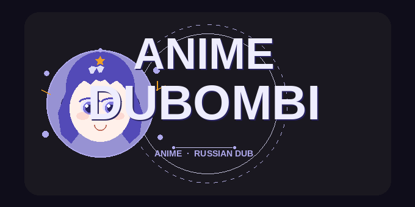

<p align="center">
  
</p>

<p align="center">
  
  
  
</p>

<h1 align="center">Anime DUBOMBI</h1>

<p align="center"><em>English dubbed anime streams for <a href="https://www.stremio.com/">Stremio</a></em></p>

A self-hosted Stremio addon that finds and serves English dub streams for anime series and movies. Uses HiAnime as the primary source with AnimeKai/Gogoanime as a fallback.

---

## Features

- English dub streams for anime series & movies
- Primary source: HiAnime (MegaCloud / VidStreaming)
- Fallback source: AnimeKai / Gogoanime
- Automatic IMDB ID → HiAnime ID mapping (Fribb + AniList + fuzzy search)
- Multi-season offset handling for split-cour anime
- Admin dashboard at `/dashboard` — analytics, logs, failed lookups
- Disk-persisted cache and logs across restarts

---

## Quick Start

```bash
git clone https://github.com/your-username/anime-dubombi.git
cd anime-dubombi
npm install && npm start
```

Then open Stremio and install the addon from `http://localhost:7001/manifest.json`.

---

## Installation

### 1. Prerequisites

Make sure you have the following installed:

- [Node.js](https://nodejs.org/) **v18 or higher**
- **npm** (comes with Node.js)
- **Git**

Verify your Node.js version:

```bash
node --version   # should print v18.x.x or higher
```

---

### 2. Clone the Repository

```bash
git clone https://github.com/your-username/anime-dubombi.git
cd anime-dubombi
```

---

### 3. Install Dependencies

```bash
npm install
```

---

### 4. Configure Environment *(optional)*

By default the addon runs on port `7001`. You only need to set environment variables if you want to change the port or host it remotely.

| Variable     | Default                   | Description                                           |
|--------------|---------------------------|-------------------------------------------------------|
| `PORT`       | `7001`                    | HTTP port to listen on                                |
| `PUBLIC_URL` | `http://localhost:<PORT>` | Your public URL — required for remote hosting and enables the 12-min keep-alive ping |

**Windows (Command Prompt):**
```cmd
set PORT=8000 && set PUBLIC_URL=https://your-host.com && npm start
```

**Windows (PowerShell):**
```powershell
$env:PORT="8000"; $env:PUBLIC_URL="https://your-host.com"; npm start
```

**Linux / macOS:**
```bash
PORT=8000 PUBLIC_URL=https://your-host.com npm start
```

---

### 5. Start the Server

```bash
npm start
```

The addon will be available at:

```
http://localhost:7001/manifest.json
```

For development with **auto-reload** on file changes:

```bash
npm run dev
```

---

### 6. Add the Addon to Stremio

1. Open **Stremio**
2. Go to **Settings** → **Add-ons** → **Install Add-on**
3. Paste the manifest URL:
   ```
   http://localhost:7001/manifest.json
   ```
4. Click **Install**

> **Remote hosting?** Replace `http://localhost:7001` with your `PUBLIC_URL` (e.g. `https://your-host.com/manifest.json`).

---

## Remote Hosting Tips

If you want to run Anime DUBOMBI on a server so anyone can use it:

- Set `PUBLIC_URL` to your server's public address — this activates the keep-alive ping that prevents the process from being killed on free-tier hosts.
- Make sure port `7001` (or your custom `PORT`) is open in your firewall / security group.
- Use a reverse proxy (e.g. **nginx**, **Caddy**) to serve it over HTTPS.
- For always-on hosting consider platforms like **Railway**, **Render**, or **Fly.io**.
- **Check the Terms of Service** of any hosting platform before deploying — some free-tier or shared platforms prohibit scraping proxies or high-outbound-traffic workloads.

---

## Endpoints

| Path              | Description                                  |
|-------------------|----------------------------------------------|
| `/manifest.json`  | Stremio addon manifest                       |
| `/dashboard`      | Admin dashboard (overview, analytics, logs)  |
| `/health`         | Health check — returns `{"status":"ok"}`     |

---

<details>
<summary>⚠️ Legal Disclaimer</summary>

This addon does **not** host, store, or distribute any media files. All stream links are provided by non-affiliated third parties and are not controlled by this project.

**Third-party services** — this project uses the following external services and is not affiliated with, endorsed by, or associated with any of them:

| Service | Use |
|---------|-----|
| **HiAnime** | Primary anime stream source (via [`aniwatch`](https://github.com/ghoshRitesh12/aniwatch)) |
| **AnimeKai / Gogoanime** | Fallback stream source (via [`@consumet/extensions`](https://github.com/consumet/consumet.ts)) |
| **AniList** | Anime metadata and canonical title lookup (GraphQL API, [AniList ToS](https://anilist.co/terms)) |
| **IMDB** | Title and genre lookup from public HTML pages ([IMDB Conditions of Use](https://www.imdb.com/conditions)) |
| **Fribb anime-lists** | IMDB ↔ AniList ID mapping dataset ([GitHub](https://github.com/Fribb/anime-lists), MIT) |

Accessing third-party websites through scrapers may be restricted by their Terms of Service. You are solely responsible for ensuring your use of this software complies with the terms of each service and with the laws and regulations of your jurisdiction.

All trademarks, service marks, and trade names referenced here are the property of their respective owners.

The authors of this project bear no liability for how it is used.

</details>

---

## License

MIT — see [LICENSE](LICENSE) for full text.
